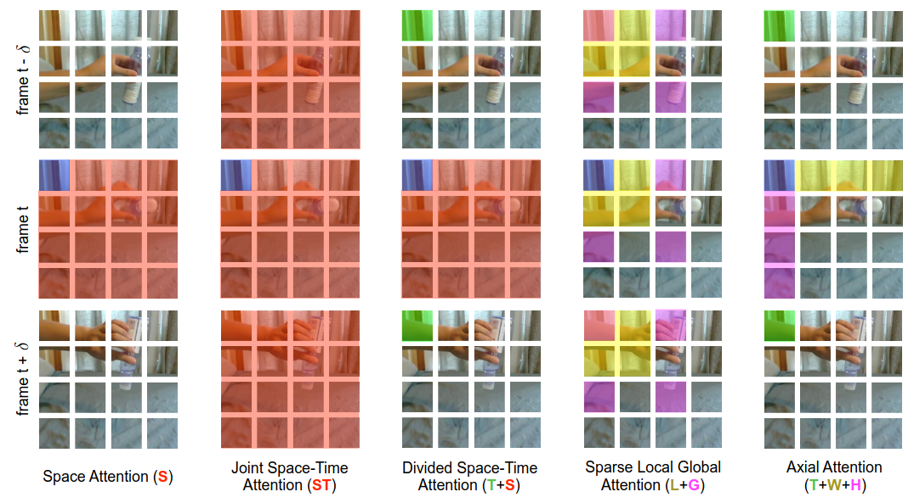
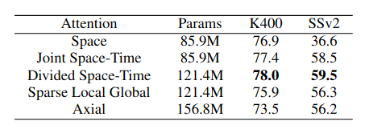
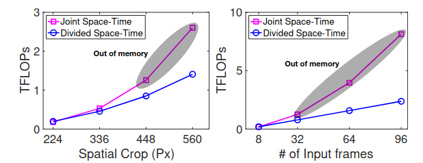
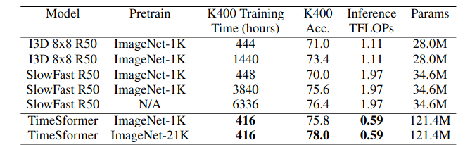
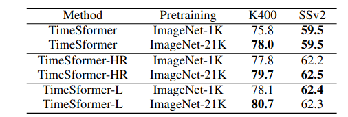
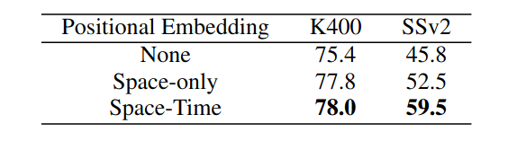
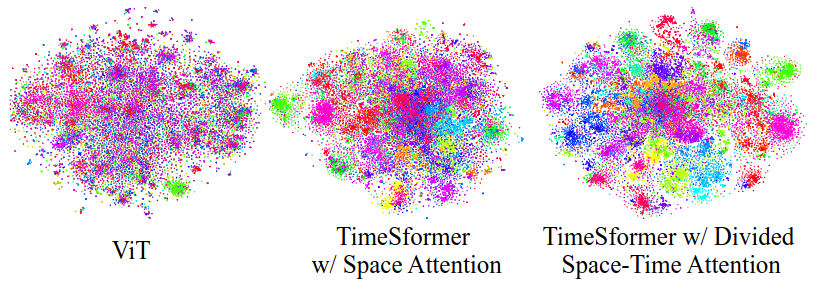

# **ADL-3 Project**

Apply a deep neural network to detect movements or actions in a video sequence using the TimeSformer architecture. You can carry out the experiments using the mmaction2 framework and a database illustrating dangerous situations in railway yards (to be provided). Analyse, interpret and visualise the results.
   
Optional: Analyse the database by viewing its characteristics such as class distribution, video duration distribution, number of frames per video, etc. . 

## **Useful links**
Paper : https://arxiv.org/abs/2102.05095

GitHub : https://github.com/lucidrains/TimeSformer-pytorch

## **Paper review**

Link : https://www.youtube.com/watch?v=nvwGL_fvGIc

### **What's TimeSformer?**
How to go from vision transformers dealing with single image to video processing ? Answer is TimeSformer.

- Input : video clip = H * W * C * F ;
- Each frame is divided in N = HW/P² patches (as it's done in vision transformers) such as each patch is P * P ;
- Each patch is flatten into vectors **x** of size C*P² ;
- Linear embedding : Ex + e with **E** the learnable matrix and **e** learnable postional (**space + time**) embedding ;
- Q, K, V and multi-heads attention is the same as vision transformers.

### **Different attention methods**

- **Space attention** : same as vision trasnformers;
- **Joint space-time attention** : attention based on all the patches of all the frames;
- **Divided space-time attention** : attention based on all the patches on the same frame and also all the patches on the same position in others frames;
- **Sparse local global attention** : apporximation of joint space-time attention with less computational cost;
- **Axial attention** : attention based on all the patches on the same row and column on the same frame and also all the patches on the same position in others frames.

### **Results comparaison**

Notice that : 
- Joint space-time makes **N*F** comparaisons per patch;
- Divided space-time makes **N+F** comparaisons per patch.

This can leads to **out of memory problem** : 

### **TimeSformer vs 3D CNN**

Notice that :
- TimeSformer has more parameters so more learning capabilities;
- Moreover, the inference cost in term of TFLOPs is lower; 
- Moreover, the training time on GPU is significantly lower; 
- Due to the number of parameters, the model need to be pretrained on imagenet.

### **Variants of TimeSformer**
| Model | Size of video clip : F * H * W| 
| --- | --- |
|TimeSformer | 8 * 224 * 244 |
|TimeSformer-HR | 16 * 448 * 448 |
|TimeSformer-L | 96 * 224 * 244 |

### **Importance of positional embeddings**

In the **K400** dataset, space embeddings are more importe than time embeddings. But in the case of **SSv2** dataset, where the time becomes very important to detect action, time embedding increase drastically the score of the prediction.

- **K400** : The dataset contains 400 human action classes, with at least 400 video clips for each action.

- **SSv2** : The 20BN-SOMETHING-SOMETHING V2 dataset is a large collection of labeled video clips that show humans performing pre-defined basic actions with everyday objects.

### **Visualisation of the understanding of TimeSformer**
